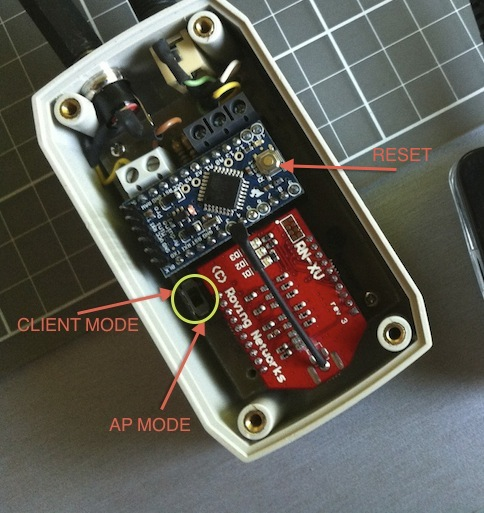
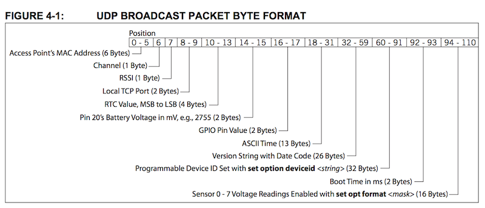

# AgricIO

## Descripción 

Un sistema electrónico capaz de notificar el estado de un interruptor físico a la aplicación Android de Agroguía mediante UDP/TCP a través de la conexión Wifi creada por el propio sistema actuando como punto de acceso. 

## Especificaciones hardware

El hardware consta de dos partes:

Por una parte, una caja con Arduino y un modulo wifi que va conectada a la alimentación. El voltaje de alimentación debe ser de entre 5v y 9v en corriente continua (DC). También dispone de un conector jack stereo 3,5mm hembra para conectar el interruptor que va en otra caja.

En la otra caja más pequeña, está el interruptor de palanca y un led. El led simplemente como indicador de refuerzo para saber si el interruptor está en ON/OFF. Esta caja también con un conector jack hembra para conectarlo a la caja central usando un cable jack macho-macho de la medida adecuada.

## Modos de conexión wifi

Existen dos modos de conectar al modulo wifi; en modo AP o en modo cliente. La forma de elegir el modo es mediante un interruptor presente cerca del modulo wifi dentro de la caja principal. Según su posición al resetear o encender el sistema, arrancará en un modo u otro.

 

**En el AP mode**, el módulo crea una red wifi a la que podemos conectarnos como cliente. La wifi es abierta y su nombre por defecto es "Wifly-EZX-xx", donde "xx" son las dos ultimas cifras de su MAC. En el modo AP, el módulo siempre tiene la ip 1.2.3.4 y asignará al dispositivo que se conecte a su red IP's de ese rango (1.2.3.xx)

**En el Client mode**, el módulo wifi es capaz de conectarse a una red wifi existente. Para ello necesita saber el SSID y la contraseña de esa red. Si no lo hemos configurado para conectarse a una red todavía, el proceso es muy sencillo. 

- Se coloca el interruptor en *Client Mode*. 
- Pulsamos el botón *reset* y esperamos a que parpadee el led verde
- Colocamos el interruptor en *AP Mode*
- Volvemos a colocar el interruptor en *Client Mode*. Parpadearán los leds rojo y verde alternándose.
- Ahora conectamos desde el dispositivo que sea (teléfono, tablet, pc..) a la wifi que ha creado el modulo. Algo así como "Wifly-EZX-xx"
- Una vez conectados a esta wifi, abrimos en un navegador la dirección `http://config` y configuramos la conexión a nuestra red. Una vez configurada, pulsamos "Exit web configuration app" y el modulo se reiniciará conectándose a la red como un equipo más. 
- Siempre que arranquemos en *Client mode* se conectará a la misma wifi configurada.

## Discovery

En cualquiera de los modos de conexión wifi anteriores, el módulo anuncia mediante paquetes UDP llamados "heartbeats". Lo hace cada 4 segundos mandando 2 paquetes por broadcasting a la dirección 255.255.255.255 al puerto 55555.

El formato del paquete UDP es el siguiente:

 

El paquete diferente 
contiene información sobre el modulo, aunque lo que realmente nos interesa es la IP remitente, pues con ella sabremos donde conectarnos. Si estamos en modo AP, será siempre 1.2.3.4, pero si el modulo está conectado a una red wifi existente, tendrá una IP asignada por el servidor DHCP de la misma.

Dentro del paquete UDP también se especifica el puerto TCP (*Local TCP port 2 bytes*) en el que escucha, que por defecto es el 2000, aunque si este cambia podemos leerlo del heartbeat para mayor seguridad.

Una vez conocemos la ip y el puerto, nos podemos conectar con el modulo por TCP. Por defecto el modulo nos saluda con el siguiente texto "\*HELLO\*". A partir de este momento, la comunicación ser realiza mediante el protocolo binario descrito.

## Protocolo 

El protocolo elegido es una versión reducida del protocolo Firmata, usando los llamados mensajes Sysex. Estos mensajes tiene el siguiente formato:

	Start           : 0xF0
	Command         : 0x00 - 0x7F  (0-127)
	Values          : codificados como pares de 7bits
	End             : 0xF7

	+-
	| Start | Command | v1a | v1b | … | vNa | vNb | End |
	+-
	
Como se ve en el esquema anterior, hay un byte de comienzo, siempre 0xF0, un comando (entre 0x00 y 0x7F) seguido de una lista de valores, que son bytes codificados en pares de 7 bits para no usar bytes que puedan ser confundidos con el principio o final del mensaje. Estos valores en pares de 7 bits van en orden de primero el LSB y luego el MSB. La forma en que se calculan es la siguiente:

	LSB = byte & B01111111
	MSB = byte >> 7 & B01111111
	
Puesto que las necesidades ahora mismo son muy sencillas, solamente existen un par de paquetes posibles. El formato es idéntico para los mensajes en una dirección u otra (Arduino -> Android -> Arduino), lo que cambia es el código de comando y el significado de los valores.

Los dos disponibles ahora son: 

- PROTOCOL_CMD_REQUEST_SWITCH_STATE: Para solicitar el estado del interruptor
- PROTOCOL_CMD_REPORT_SWITCH_STATE: Para reportar el estado del interruptor

Si no solicitamos el estado del interruptor, recibiremos igualmente una PROTOCOL_CMD_REPORT_SWITCH_STATE

### Solicitar estado del interruptor

Devuelve el estado del interruptor en forma de PROTOCOL_CMD_RESPONSE_SWITCH_STATE.

	Name: PROTOCOL_CMD_REQUEST_SWITCH_STATE   
	Command: 0x01
	Values : No

	+-
	| Start | Cmd  | End  |
	+-
	| 0xF0  | 0x01 | 0xF7 |
	+-
	
### Reporta estado del interruptor

Reporta el estado del interruptor.

	Name: PROTOCOL_CMD_RESPONSE_SWITCH_STATE   
	Command: 0x01
	Values : Value1 = 0 -> interruptor OFF
	         Value1 = 1 -> interruptor ON

	+-
	| Start | Cmd  | Value1 | End  |
	+-
	| 0xF0  | 0x01 |        | 0xF7 |
	+-

